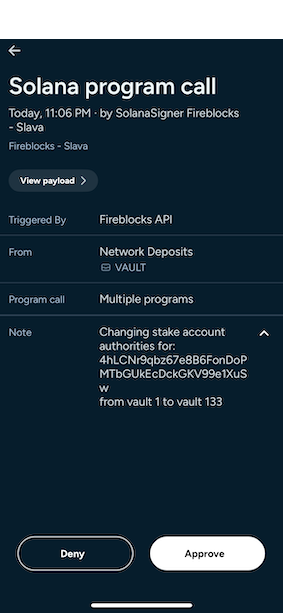

# Change Solana Stake Authorities

This script is changing Solana stake account staking and withdrawal authorities to a new given account using the Fireblocks Program Call Feature.

This script utilizes the Fireblocks Solana Web3 Adapter. 

Learn more [here](https://developers.fireblocks.com/reference/solana-web3-adapter).


## Prerequisites

Make sure to have the following prerequisites in place before running the script:

 - Solana Program Call feature enabled
 - [Fireblocks API User](https://developers.fireblocks.com/docs/manage-api-keys)
 - [Program Call Transaciton Authorization Policy rule in place](https://developers.fireblocks.com/docs/set-transaction-authorization-policy)
 - [Whitelist the Solana Stake Program address as an External Wallet](https://developers.fireblocks.com/docs/whitelist-addresses)
    - The Stake Program address can be found [here](https://docs.anza.xyz/runtime/programs#stake-program).
 


## Installation

Clone this repository and install dependencies

```bash
  git clone <repository>
  cd solana-staking-authorities
```

Install dependencies:

```bash
npm install
```

    
## Configuration

To run this project, you will need to set the following variables in the `main.ts` file:

```bash
`API_KEY` - your Fireblocks API Key
`API_SECRET_PATH` - path to your Fireblocks API Secret key
`CURRENT_AUTHORITY_VAULT` - the existing authority Fireblocks vault account ID
`NEW_AUTHORITY_VAULT` - the new authority Fireblocks vault account ID
`STAKE_ACCOUNTS` - an array of the stake accounts to change
```


**Example:**

```js
const API_KEY = "00000000-0000-0000-0000-000000000000";
const API_SECRET_PATH = "./fireblocks_secret_new.key";
const CURRENT_AUTHORITY_VAULT = "2";
const NEW_AUTHORITY_VAULT = "133";
const STAKE_ACCOUNTS = [
  '9BpJAdXfRk4EoavH65BgcjNFdzDMekBJxJ1sm5xB82LC',
  '4hLCNr9qbz67e8B6FonDoPMTbGUkEcDckGKV99e1XuSw'
];
```


## Running

```bash
  npm start
```

## Signing Manually

Program Calls that are signed manually will appear in the Fireblocks mobile application as a "Solana Program Call" operation:



If we click on "View Payload" button, we'll see 2 `Stake Program` interactions. 
The reason is that changing authorities requires an instruction per authority type (1 for Staking Authority and 1 for Withdrawal Authority):


If we expand the first instruction, we'll see that the instruction's name is `authorize` and it has 2 arguments:
1. The new authority address
2. Stake Authorization Type - Index=false (equals to 0 which means it's a `Stake` authority type)


If we exapand the second instruction, we'll see almost the same information except for the Stake Authorization Type:
1. Index=true (equals to 1 which means it's a `Withdrawal` authority type)


